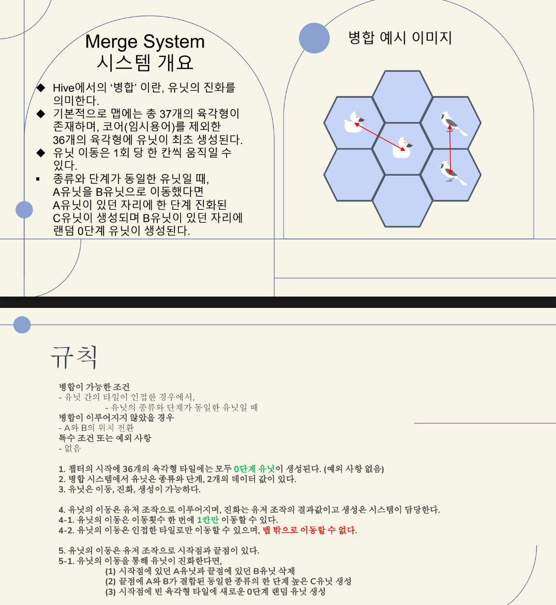

# Aardel

## :ribbon: 소개

2D 병합 타워 디펜스 입니다. 아기자기한 캐릭터들을 배치하여 적을 막아보세요.

## :camera: 스크린샷

## :video_camera: 동영상

게임 플레이 데모 동영상입니다.

[YouTube에서 데모 동영상 보기](https://youtu.be/CImKp8mz5OM?si=9x8Mgv2Pp_zxKDLg)

## :pushpin: 게임 개요
- 게임 이름: Aardel(아르델)
- 장르: 머지 디펜스 (병합, 타워디펜스)
- 플랫폼: Android / iOS
- 대상:
    - 머지 장르를 선호하는 유저층
    - 타워 디펜스 장르를 선호하는 유저층
    - 귀여운 캐릭터들의 수집을 선호하는 유저층

## :dart: 기획 의도
- 각 유닛들의 장단점, 특이점과 함께
유닛들 상호간의 시너지 효과, 배치
효과 등으로 매 판, 매 상황 마다
다른 플레이를 유도하는 것

## :video_game: 게임 플레이

게임 플레이 방법

- 게임 루프
- 캐릭터 병합 라운드
- 몬스터 웨이브 라운드
- 보스 라운드

## :game_die: 핵심 기능

- 캐릭터 병합 시스템
- 독특한 턴 제 시스템
- 캐릭터 별 전투 시스템

## :floppy_disk: 사용된 기술

- Unity
- C#

## :hash: 참여인원

- Game Director

  - 기획 양진영
  - 서브기획 권상헌

- Game Programmer

  - 프로그래밍 이준호

- Graphic Designer
  - 아트디렉터 이승록
  - 캐릭터 일러스트 서현우
  - 캐릭터 심볼 신예림
  - 배경 이소원
  - UI/UX 홍정기
  - 적대적 몬스터 디자인 김준혁

## 📥 다운로드

### 🆕 최신 버전 다운로드

